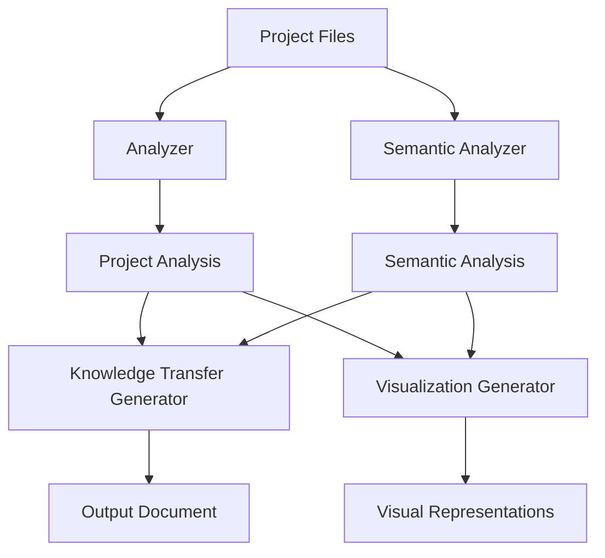

# Architecture Overview

This document provides an overview of Project Mapper's architecture, explaining its major components, control flow, and design patterns.

## System Architecture

Project Mapper follows a modular, pipeline-oriented architecture. It consists of several main components that work together to analyze codebases and generate knowledge transfer documents.

### Major Components

#### 1. Core Library

The core library contains the main functionality and business logic of Project Mapper.

- **Location**: `src` directory
- **Responsibilities**:
  - Implement core analysis algorithms
  - Process project data
  - Provide the main API

#### 2. Analyzer Module

The analyzer module examines the project structure, files, and code.

- **Location**: `src/analyzer.js`
- **Responsibilities**:
  - Scan project directories and files
  - Parse code to extract structure and relationships
  - Identify key components and files
  - Build dependency relationships

#### 3. Semantic Analyzer

The semantic analyzer extracts domain-specific concepts and terminology.

- **Location**: `src/semantic-analyzer.js`
- **Responsibilities**:
  - Extract domain concepts from code and documentation
  - Build relationship graphs between concepts
  - Generate domain glossary
  - Map concepts to file locations

#### 4. Knowledge Transfer Generator

This module creates the knowledge transfer documents based on the analysis.

- **Location**: `src/knowledge-transfer.js` and `src/knowledge-transfer-enhanced.js`
- **Responsibilities**:
  - Generate structured documentation from analysis data
  - Apply templates (standard, minimal, detailed)
  - Format output in markdown or JSON
  - Incorporate semantic information

#### 5. Visualization Module

The visualization module creates visual representations of project concepts.

- **Location**: `src/visualization.js`
- **Responsibilities**:
  - Generate concept network diagrams
  - Create Mermaid.js diagrams
  - Build interactive visualizations
  - Produce concept distribution heatmaps

#### 6. CLI Interface

The command-line interface handles user interaction.

- **Location**: `src/cli.js`
- **Responsibilities**:
  - Parse command-line arguments
  - Configure and orchestrate the analysis process
  - Display progress and results
  - Handle errors and provide feedback

## Control Flow

The typical flow of execution in Project Mapper follows these steps:

1. **Input Processing**: Command-line arguments are parsed and validated.
2. **Project Scanning**: The system scans the project directory, identifying files and structures.
3. **Code Analysis**: Code files are parsed to extract functions, classes, imports, and exports.
4. **Semantic Analysis**: Domain concepts and terminology are extracted from code and documentation.
5. **Relationship Building**: The system builds relationship graphs between components.
6. **Knowledge Transfer Generation**: The analysis results are formatted into a structured document.
7. **Output Generation**: The final document is written to the specified output file.

## Key Design Patterns

Project Mapper employs several design patterns and architectural approaches:

### ES Modules

The project uses ES module system (`import`/`export`) for code organization and dependency management, allowing for clear module boundaries and easier maintenance.

### Functional Approach

Project Mapper primarily uses functions and composition rather than classes. This approach leads to more testable and composable code with fewer side effects.

### Modular Architecture

The codebase is organized into focused, single-purpose modules, each responsible for a specific aspect of the system. This separation of concerns makes the code easier to understand and maintain.

### Pipeline Architecture

Data flows through sequential stages of transformation, from raw project files to structured analysis to formatted output. This pipeline approach simplifies processing and allows for intermediate results to be examined or modified.

## Data Flow Diagram



## Component Interactions

- **CLI → Analyzer**: The CLI configures and invokes the analyzer with user-specified options.
- **Analyzer → Semantic Analyzer**: The analyzer may trigger semantic analysis when enhanced understanding is needed.
- **Analyzer + Semantic Analyzer → Knowledge Transfer**: Both analysis results feed into the knowledge transfer generation process.
- **Knowledge Transfer → Visualization**: The analysis data can be used to generate visual representations.
- **CLI → Output**: The CLI writes the generated documents to the file system.

## Code Organization

The Project Mapper codebase is organized as follows:

```
src/
├── analyzer.js           # Core project analysis
├── cli.js                # Command-line interface
├── index.js              # Main entry point and API exports
├── knowledge-transfer.js # Standard knowledge transfer generation
├── knowledge-transfer-enhanced.js # Enhanced knowledge transfer with semantics
├── semantic-analyzer.js  # Domain concept and terminology extraction
└── visualization.js      # Visualization generation

test/
├── basic.test.js         # Basic functionality tests
├── commonjs.test.cjs     # CommonJS compatibility tests
├── mock.test.js          # Tests with mocked data
├── semantic-integration.test.js # Semantic analysis integration tests
└── simple.test.js        # Simple utility tests
```

## Implementation Details

### Analyzer Implementation

The analyzer uses several techniques to understand project structure:

1. **File traversal**: Uses `fast-glob` to efficiently scan the project directory.
2. **AST parsing**: Uses `acorn` to parse JavaScript/TypeScript files into Abstract Syntax Trees.
3. **Pattern matching**: Applies heuristics to identify important files and components.
4. **Dependency resolution**: Traces import/export relationships to build a dependency graph.

### Semantic Analysis Implementation

The semantic analyzer extracts domain concepts using natural language processing techniques:

1. **Tokenization**: Breaks text into words and phrases.
2. **TF-IDF analysis**: Identifies important terms based on their frequency and uniqueness.
3. **N-gram generation**: Finds multi-word concepts that appear frequently together.
4. **Relationship detection**: Identifies connections between concepts based on co-occurrence.

### Knowledge Transfer Generation

The knowledge transfer generation follows a template-based approach:

1. **Template selection**: Chooses the appropriate template based on user configuration.
2. **Section generation**: Creates each section of the document using analysis data.
3. **Content formatting**: Organizes the content into a readable structure.
4. **Output formatting**: Produces the final document in Markdown or JSON format.

## Extension Points

Project Mapper is designed to be extensible in several ways:

1. **Custom templates**: New templates can be added to the `TEMPLATES` object in `knowledge-transfer.js`.
2. **Additional analyzers**: New analysis techniques can be added as separate modules.
3. **Output formats**: Support for additional output formats can be added to the knowledge transfer generator.
4. **Visualization types**: New visualization techniques can be added to the visualization module.